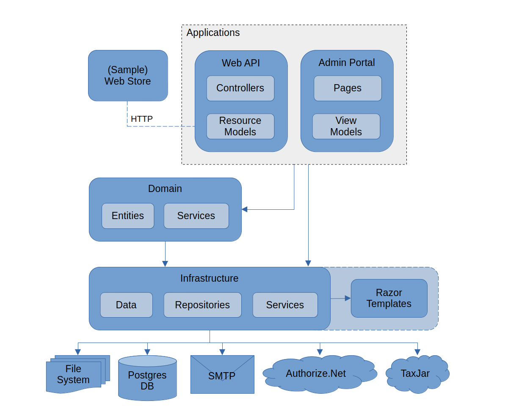
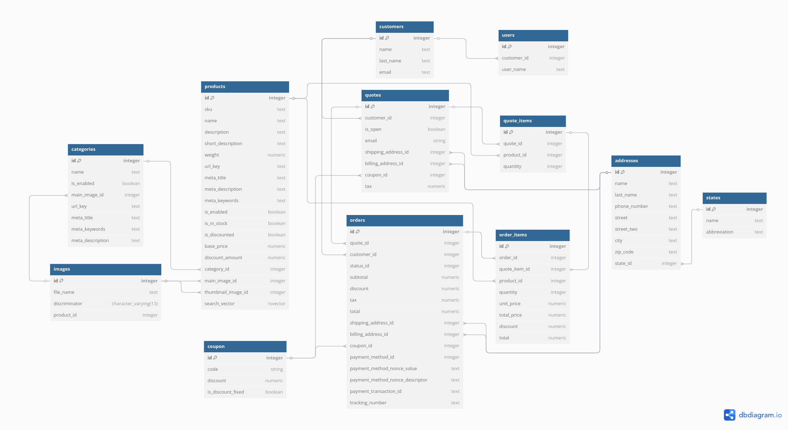

# End Point Commerce

Minimalist E-Commerce backend that's quick to set up and easy to understand. Meant for developers to adapt, customize and extend.

[](https://bits.endpointdev.com/end-point-open-source/end-point-commerce/-/commits/main)

## Table of contents

- [Features](#features)
- [Dependencies](#dependencies)
- [Deploying and running the system](#deploying-and-running-the-system)
  - [With Docker Compose](#with-docker-compose)
    - [Deploying for the first time](#deploying-for-the-first-time)
      - [1. Clone this repository and configure secrets and environment vars](#1-clone-this-repository-and-configure-secrets-and-environment-vars)
      - [2. Start the services](#2-start-the-services)
      - [3. Initialize the database](#3-initialize-the-database)
      - [4. Verify everything works](#4-verify-everything-works)
      - [5. Log into the Admin Portal](#5-log-into-the-admin-portal)
    - [Updating an existing deployment](#updating-an-existing-deployment)
      - [1. Stop the services](#1-stop-the-services)
      - [2. Pull your changes](#2-pull-your-changes)
      - [3. Restart the services](#3-restart-the-services)
      - [4. Apply database migrations](#4-apply-database-migrations)
  - [With Development Containers and Visual Studio Code](#with-development-containers-and-visual-studio-code)
    - [1. Clone this repository](#1-clone-this-repository)
    - [2. Configure some of the Development app settings](#2-configure-some-of-the-development-app-settings)
    - [3. Run the Development Containers](#3-run-the-development-containers)
    - [4. Run the apps](#4-run-the-apps)
    - [5. Log into the Admin Portal](#5-log-into-the-admin-portal-1)
  - [With .NET and Node.js installed locally](#with-net-and-nodejs-installed-locally)
    - [1. Install .NET framework and tools, and Node.js](#1-install-net-framework-and-tools-and-nodejs)
    - [2. Create a PostgreSQL database](#2-create-a-postgresql-database)
    - [3. Clone this repository and configure app settings](#3-clone-this-repository-and-configure-app-settings)
    - [4. Initialize the database](#4-initialize-the-database)
    - [5. Run the apps](#5-run-the-apps)
    - [6. Log into the Admin Portal](#6-log-into-the-admin-portal)
- [System operation under Docker Compose deployments](#system-operation-under-docker-compose-deployments)
  - [Deployment quick summary](#deployment-quick-summary)
  - [Useful Docker commands](#useful-docker-commands)
  - [Interacting with the database](#interacting-with-the-database)
  - [Database administration](#database-administration)
  - [Catalog images](#catalog-images)
  - [Keys for .NET's Data Protection API](#keys-for-nets-data-protection-api)
  - [Dangling container images and unused build cache](#dangling-container-images-and-unused-build-cache)
- [Development](#development)
  - [Useful development commands](#useful-development-commands)
  - [Automated tests](#automated-tests)
  - [Managing frontend assets](#managing-frontend-assets)
  - [Code base structure](#code-base-structure)
  - [Conceptual architecture](#conceptual-architecture)
  - [Data model](#data-model)
- [CI](#ci)
  - [Variables](#variables)
  - [Container Registry](#container-registry)

## Features


1. An Admin Portal for managing the store.
2. A REST API for building user-facing frontends.
3. A sample web store frontend that demonstrates core API interactions and Auth.NET integration.
4. Shopping cart handling for guests and logged in users.
5. Checkout as a guest and as a logged in user.
6. Product catalog and categories management.
7. Product and category images upload.
8. Authentication and user account management.
9. Handling of customers address books.
10. Discounts and coupons.
11. Payment processing with Authorize.NET.
12. Sales tax calculation with TaxJar.
13. Email delivery for order confirmation and authentication.
14. Simple backend-managed HTML content for frontends.

## Dependencies

This system depends on the following software and services:

1. **[.NET](https://dotnet.microsoft.com)**: the system is written using the .NET framework.
2. **[PostgreSQL](https://www.postgresql.org/)** is used to store system data.
3. **[Node.js](https://nodejs.org)** is used to run the frontend asset bundling processes.
4. **[pnpm](https://pnpm.io/)** is used to manage dependencies and bundling scripts.
5. **[Authorize.NET](https://www.authorize.net/)** is the web service used to process payments.
6. **[TaxJar](https://www.taxjar.com/)** is the web service used to calculate sales taxes.

## Deploying and running the system

This system is composed of three separate web applications: The **Admin Portal**, the **Web API** and the **Web Store**. Depending on your use case you can pick and choose which ones to run. Keeping in mind that the Web Store depends on the Web API. Out of the box, there are three main ways to get the system up and running:

1. With the included Docker Compose configuration. Recommended for production.
2. With [Development Containers](https://containers.dev/) and [Visual Studio Code](https://code.visualstudio.com/docs/devcontainers/containers).
3. With .NET and Node.js installed locally.

### With Docker Compose

If you're trying to deploy this project somewhere, or you're just trying to run it locally without a full development environment ready, you can make use of the Docker Compose file `compose.yml` found in the root directory.

In order to run the system with this approach, you'll need to have installed:

- [Docker](https://www.docker.com/)
- [Docker Compose](https://docs.docker.com/compose/)

This is the approach that we recommend for production deployments.

Here's a step by step guide on how to get the system running using this strategy for development.

#### Deploying for the first time

Let's first go over what you'd have to do to create a new deployment from scratch.

##### 1. Clone this repository and configure secrets and environment vars

The easiest way to get started is just to clone this repository to wherever you intend to run it from:

```sh
git clone git@bits.endpointdev.com:end-point-open-source/end-point-commerce.git
```

There are several settings that need to be configured via Docker secret files and environment variables. The secrets are stored found under `/secrets` and need to be modified like the following:

1. Set `postgres-db-password.txt` to a secure password that will be used for the Postgres database server's `postgres` user.
2. Set `end-point-commerce-db-password.txt` to a secure password for the user that will be used by the EndPointCommerce services to connect to the Postgres database.
3. Update the connection string found in `end-point-commerce-db-connection-string.txt` to ensure it is correct for your environment. In the majority of cases, all you will need to do is simply copy the password from the previous `end-point-commerce-db-password.txt` file, at put it at the end of the connection string here.

The environment variables are expected to be configured via the `/.env` file. Copy `/env.template` to a new `/.env` file and modify it as appropriate for your deployment. Here's a description of the available variables:

- `ADMIN_PORTAL_PORT`, `WEB_API_PORT` and `DB_PORT` determine the ports in which the various services will be run.
- `END_POINT_COMMERCE_DB`, `END_POINT_COMMERCE_DB_USERNAME` configure the system's database name and the user it will use to connect to it.
- `ASPNETCORE_ENVIRONMENT` determines the .NET runtime environment.
- `CATEGORY_IMAGES_URL`, `PRODUCT_IMAGES_URL` determines the URLs of product and category images. Used by the Web API to link to them. This could be the URL where the Web API itself will be running. It could also be any other URL that you have configured in your web server to expose the files from the `images/category-images` and `images/product-images` directories.
- The `MAIL_SETTINGS_*` ones determine the SMTP server to connect to for email delivery.
- `MAIL_CC_ADDRESSES` and `MAIL_BCC_ADDRESSES` determine which addresses will be sent CCs and BCCs of the emails generated by the system.
- The `TAX_JAR_*` ones determine the TaxJar credentials to use for sales tax calculations.
- The `AUTH_NET_*` ones determine the Authorize.NET credentials to use for payment processing.

##### 2. Start the services

To start up all the services and build the images run:

```sh
docker compose up -d --build
```

This will start them all up in the background. You can follow the logs live while everything starts up by running:

```sh
docker compose logs -f
```

> Please note that with the way the `compose.yml` is out-of-the-box in this repository, the images that will be run are configured to be built locally from the various `Dockerfile`s that are also found in the root of this repository. The images you end up running will be directly built from the current commit of this repository that you have cloned. Most "real world" production deployments would likely wish to use tagged images built and pushed elsewhere (such as via a CI/CD pipeline). To do this, you will need to make some simple modifications to the `compose.yml`.

##### 3. Initialize the database

Upon first deployment, a PostgreSQL database will be up and running in its own container. However, this database is empty and needs to be initialized. In order to do that, the EF Core database migration need to run. The Docker Compose file provides a `maintenance` container as a convenience which can be used to do various maintenance tasks, including applying database migrations.

To run the migrations simply run:

```sh
docker compose exec maintenance run-migrations.sh
```

After a short wait, they should complete successfully.

If this is the first time you've run the migrations, you will likely see the following error:

```text
Failed executing DbCommand (16ms) [Parameters=[], CommandType='Text', CommandTimeout='30']
SELECT migration_id, product_version
FROM "__EFMigrationsHistory"
ORDER BY migration_id;
```

As long as you see one or more `Applying migration ...` lines after this error, you can safely ignore it for the first run, as it is expected (the table in question doesn't exist until the migrations have been run at least once). It shouldn't happen again on subsequent runs.

##### 4. Verify everything works

Assuming you made no changes to the `.env` variables regarding ports, you should now be able to access the running services via the following URLs:

- **AdminPortal**: http://localhost:8001
- **WebApi**: http://localhost:8002/swagger
- **WebStore**: http://localhost:8003. Remember that this is meant as a demo and may not be suitable for your production deployments.

And the database will be running on port 5432. Which you can connect to using:

```sh
psql -h localhost -d end_point_commerce -U end_point_commerce -W
```

The password being defined in the `secrets/end-point-commerce-db-password.txt` file.

If you want to expose the applications to the internet via an NGINX reverse proxy, consider the included `nginx.conf` as an example.

##### 5. Log into the Admin Portal

<!-- TODO: LOAD THE CONNECTION STRING ENV VAR -->

In order to log into the Admin Portal, you will need to create an admin user account first. This can be done with the `EndPointCommerce.Jobs` project. You can follow these steps to create the user account:

- Connect to the maintenance container with `docker compose exec maintenance bash`.
- Change into the `EndPointCommerce.Jobs` directory with `cd EndPointCommerce.Jobs`.
- Run the `create_admin_user` command with: `dotnet run -- create_admin_user -u USERNAME -e EMAIL -p PASSWORD`. Choosing your desired `USERNAME`, `EMAIL` and `PASSWORD`.

#### Updating an existing deployment

Updating an existing deployment with an updated version more or less follows the steps outlined above, assuming you haven't made significant modifications to the `compose.yml` to suit your particular environment.

##### 1. Stop the services

Stop everything that is running currently:

```sh
docker compose down
```

##### 2. Pull your changes

Either run `git pull` or re-copy your updates to your deployment environment however you prefer in your particular environment.

##### 3. Restart the services

Now start everything back up again and re-build updated images (unless you have updated your `compose.yml` to pull tagged images from a repository, then you can of course omit the `--build` argument)

```sh
docker compose up -d --build
```

##### 4. Apply database migrations

If your update includes any database migrations, you should run them now:

```sh
docker compose exec maintenance run-migrations.sh
```

You can also check if there are any pending database migrations that need to be run first if you prefer:

```sh
docker compose exec maintenance check-migrations.sh
```

> From time to time, clean up old dangling images with `docker image prune`.

### With Development Containers and Visual Studio Code

This solution has [Development Containers](https://containers.dev/) configuration in place. This means that a containerized development environment can be spun up and used to develop and test the system. The relevant files are located under the `.devcontainer` directory.

In order to run a Development Container, you need:

- [Docker](https://www.docker.com/)
- [Docker Compose](https://docs.docker.com/compose/)
- [VS Code](https://code.visualstudio.com/)
- [VS Code's Dev Containers extension](https://marketplace.visualstudio.com/items?itemName=ms-vscode-remote.remote-containers).

Here's a list of steps to get this running:

#### 1. Clone this repository

Once you have all that installed, clone this repo:

```sh
git clone git@bits.endpointdev.com:end-point-open-source/end-point-commerce.git
```

#### 2. Configure some of the Development app settings

You will then also have to configure some of the system settings via the `appsettings.Development.json` files. Most of them, not all, are already preset to values that make sense for a development environment using Development Containers. Here are the ones that are missing:

- In `EndPointCommerce.WebApi/appsettings.Development.json`, set:
  - The settings under `MailSettings` to that of your SMTP server.
  - The `TaxJar*` settings to that of your TaxJar account.
  - The `AuthNet*` settings to that of your Authorize.NET account.

- In `EndPointCommerce.WebStore/appsettings.Development.json`, set:
  - The `AuthNet*` settings to that of your Authorize.NET account.

You should configure these to have all the features working.

#### 3. Run the Development Containers

Finally, open the project directory in VS Code and run the "Dev Containers: Reopen in Container" command via the Command Palette (Ctrl+Shift+P).

That will download and build the necessary images and containers: one for the PostgreSQL database and one with .NET for running and debugging the apps themselves. Once done, VS Code will connect to the app container and you'll be able to develop in the container as if it was your host machine. `Node.js`, along with `pnpm`, as well as the `dotnet-aspnet-codegenerator` and `dotnet-ef` tools will also be installed without needing any extra steps.

On first run, it'll be necessary to create the database and apply all migrations with `dotnet ef database update`. This will work if run from within the `EndPointCommerce.WebApi` or `EndPointCommerce.AdminPortal` directories.

#### 4. Run the apps

You can now run the apps and the tests. You can run tests with `dotnet test` and they should all pass now.

You can now start any of the apps by running `dotnet run` from within their respective directories: `./EndPointCommerce.AdminPortal` for the Admin Portal, `./EndPointCommerce.WebApi` for the Web API, and `./EndPointCommerce.WebStore` for the Web Store. You can access the running apps at:

- The Web API at http://localhost:5240/swagger/
- The Admin Portal at http://localhost:5047/
- The Web Store at https://localhost:7166/

Note also that you may need to trust the ASP.NET Core developer certificate in order to be able to run the Web Store with HTTPs, like it is set up to do by default. Check more details on that here: https://aka.ms/aspnet/https-trust-dev-cert.

#### 5. Log into the Admin Portal

In order to log into the Admin Portal, you will need to create an admin user account first. This can be done with the `EndPointCommerce.Jobs` project. You can follow these steps to create the user account:

- Change into the `EndPointCommerce.Jobs` directory with `cd EndPointCommerce.Jobs`.
- Run the `create_admin_user` command with: `dotnet run -- create_admin_user -u USERNAME -e EMAIL -p PASSWORD`. Choosing your desired `USERNAME`, `EMAIL` and `PASSWORD`.

### With .NET and Node.js installed locally

Like any other application, this system can run in any machine with the necessary system software installed. In order to run the system with this method, you'll need:

- [.NET](https://dotnet.microsoft.com)
- [PostgreSQL](https://www.postgresql.org)
- [Node.js](https://nodejs.org)
- [pnpm](https://pnpm.io)

Here's a step by step guide on how to get the system running using this strategy for development.

#### 1. Install .NET framework and tools, and Node.js

Installing this software will vary greatly depending on your environment. But here's what that could look like in Ubuntu 24.04 and similar Linux distros.

To install .NET:

- Run `sudo add-apt-repository ppa:dotnet/backports` to install the package repository where supported .NET versions are available.
- Run `sudo apt-get update && sudo apt-get install dotnet-sdk-9.0` to install the .NET 9.0 SDK.
- Run `dotnet --version` to validate the installation succeeded.

To install .NET CLI tools:

- Run `dotnet tool install dotnet-ef --global`.
- Run `dotnet tool install dotnet-aspnet-codegenerator --global`.

To install Node.js and PNPM:

- Run `curl -fsSL https://deb.nodesource.com/setup_22.x | sudo bash -` to install the package repository for Node.js.
- Run `sudo apt-get update && sudo apt-get install nodejs` to install Node.js.
- Run `sudo npm install -g pnpm@10` to install PNPM.
- Run `node --version` and `pnpm --version` to validate the installation succeeded.

#### 2. Create a PostgreSQL database

Like mentioned before, the system needs a PostgreSQL database. There are many ways to set one up, either locally, in the same machine where the system is running, or in some external server. Using Docker though, it's possible to get a PostgreSQL database up and running quickly:

```sh
docker run -d \
  --name end-point-commerce-postgres \
  -p 5432:5432 \
  -e POSTGRES_DB=end_point_commerce \
  -e POSTGRES_USER=end_point_commerce \
  -e POSTGRES_PASSWORD=password \
  postgres:17.2-bookworm
```

It would also help to install the psql CLI client to be able to connect to this database. That can be done with:

```sh
sudo apt-get update && sudo apt-get install postgresql-client
```

Now you can connect to the database using:

```sh
psql -h localhost -d end_point_commerce -U end_point_commerce -W
```

When psql asks for a password, just type in `password`. That's what the `POSTGRES_PASSWORD` env var was set to, in the `docker run` command.

#### 3. Clone this repository and configure app settings

Now that all the necessary system software is in place, you can run the applications. First clone this repository, anywhere you like:

```sh
git clone git@bits.endpointdev.com:end-point-open-source/end-point-commerce.git
```

Now you need to update several settings in the various `appsettings.json` files to have a fully working system. The most important ones, which are required to start up the apps, are these:

- In `EndPointCommerce.AdminPortal/appsettings.json`, set:
  - `ConnectionStrings.EndPointCommerceDbContext` to `Host=localhost;Database=end_point_commerce;Username=end_point_commerce;Password=password`.
  - `CategoryImagesPath` to `REPO_ROOT/images/category-images`.
  - `ProductImagesPath` to `REPO_ROOT/images/product-images`.
  - `AdminPortalDataProtectionKeysPath` to `REPO_ROOT/data-protection-keys/admin-portal`.

- In `EndPointCommerce.WebApi/appsettings.json`, set:
  - `AllowedOrigins` to the URL where your frontend is running. For a local development environment, where you want to use the WebStore project, this should be `https://localhost:7166`. This is the default URL that the WebStore starts up at with `dotnet run`.
  - `ConnectionStrings.EndPointCommerceDbContext` to `Host=localhost;Database=end_point_commerce;Username=end_point_commerce;Password=password`.
  - `CategoryImagesPath` to `REPO_ROOT/images/category-images`.
  - `ProductImagesPath` to `REPO_ROOT/images/product-images`.
  - `WebApiDataProtectionKeysPath` to `REPO_ROOT/data-protection-keys/web-api`.

- In `EndPointCommerce.WebStore/appsettings.json`, set:
  - `WebStoreDataProtectionKeysPath` to `REPO_ROOT/data-protection-keys/web-store`.
  - `EndPointCommerceApiUrl` to the URL where the Web API is running. For a local development environment, this should be `http://localhost:5240`. This is the default URL that the Web Store starts up at with `dotnet run`.

- In `EndPointCommerce.Tests/appsettings.json`, set:
  - `ConnectionStrings.EndPointCommerceDbContext` to `Host=localhost;Database=end_point_commerce_test;Username=end_point_commerce;Password=password`. Notice that `Database` is set to `end_point_commerce_test` in this connection string. This is the database used for integration testing.

And here's the rest of them, which enable other secondary functionality like emails, serving catalog images, interactions with TaxJar and Authorize.NET, etc:

- In `EndPointCommerce.WebApi/appsettings.json`, set:
  - The settings under `MailSettings` to that of your SMTP server.
  - The `TaxJar*` settings to that of your TaxJar account.
  - The `AuthNet*` settings to that of your Authorize.NET account.
  - `CategoryImagesUrl` to `WEB_API_URL/category-images`.
  - `ProductImagesUrl` to `WEB_API_URL/product-images`.
  - `PasswordResetUrl` to `WEB_STORE_URL/auth/reset-password`. This is the page in your frotnend where you offer password reset functionality to your users.
  - `MailCcAddresses` to any emails you want to receive CC of emails generated by the system.
  - `MailBccAddresses` to any emails you want to receive BCC of emails generated by the system.

- In `EndPointCommerce.WebStore/appsettings.json`, set:
  - The `AuthNet*` settings to that of your Authorize.NET account.

Considering `REPO_ROOT` as the root directory of this repository; `ADMIN_PORTAL_URL` as the URL where the Admin Portal application is running; `WEB_API_URL` as the URL where the Web API is running; `WEB_STORE_URL` as the URL where your frontend is running.

#### 4. Initialize the database

With the app settings configured, we're able to initialize the database by running the migrations. This can be done with:

```sh
dotnet ef database update --startup-project ./EndPointCommerce.AdminPortal --project ./EndPointCommerce.Infrastructure
```

#### 5. Run the apps

You can now run the apps and the tests. You can run tests with `dotnet test` and they should all pass now.

You can now start any of the apps by running `dotnet run` from within their respective directories: `./EndPointCommerce.AdminPortal` for the Admin Portal, `./EndPointCommerce.WebApi` for the Web API, and `./EndPointCommerce.WebStore` for the Web Store. You can access the running apps at:

- The Web API at http://localhost:5240/swagger/
- The Admin Portal at http://localhost:5047/
- The Web Store at https://localhost:7166/

Note also that you may need to trust the ASP.NET Core developer certificate in order to be able to run the Web Store with HTTPs, like it is set up to do by default. Check more details on that here: https://aka.ms/aspnet/https-trust-dev-cert.

#### 6. Log into the Admin Portal

In order to log into the Admin Portal, you will need to create an admin user account first. This can be done with the `EndPointCommerce.Jobs` project. You can follow these steps to create the user account:

- Change into the `EndPointCommerce.Jobs` directory with `cd EndPointCommerce.Jobs`.
- Run the `create_admin_user` command with: `dotnet run -- create_admin_user -u USERNAME -e EMAIL -p PASSWORD`. Choosing your desired `USERNAME`, `EMAIL` and `PASSWORD`.

## System operation under Docker Compose deployments

### Deployment quick summary

This is a quick guide on how to deploy changes to an already running system:

1. Checkout the desired commit or otherwise apply desired code changes.
2. If needed, review and/or update the `.env` file and the files inside the `secrets` directory.
3. If you want to shut down the system, you can stop the containers with `docker compose stop`.
4. If you want to monitor the system while deploying, tail the logs with `docker compose logs -f`.
5. Rebuild and restart the system with `docker compose up -d --build`.
6. If needed, check the pending migrations with `docker compose exec maintenance check-migrations.sh`.
7. If needed, check the pending migrations with `docker compose exec maintenance run-migrations.sh`.
8. If needed, create a new Admin Portal user account with `docker compose exec maintenance bash`, `cd EndPointCommerce.Jobs` and `dotnet run -- create_admin_user -u USERNAME -e EMAIL -p PASSWORD`.
9. From time to time, cleanup old dangling images with `docker image prune`.

### Useful Docker commands

- `docker compose exec maintenance bash` opens a bash session on the maintenance container.
- `docker compose stop` stops all containers.
- `docker compose down` deletes all containers.
- `docker compose logs -f` tails the logs of all containers.
- `docker compose logs -f admin-portal` tails the logs of the Admin Portal.
- `docker compose logs -f web-api` tails the logs of the Web API.
- `docker compose logs -f db` tails the logs of the database.
- `docker image ls -a` lists existing Docker images.
- `docker image prune` deletes dangling images.
- `docker builder prune` deletes unused Docker builder cache.

### Interacting with the database

The database process is running in its own container. The data files will be stored in a [Docker Volume](https://docs.docker.com/storage/volumes/) named `db-postgres-data`.

You can connect to the database using:

```sh
psql -h localhost -d end_point_commerce -U end_point_commerce -W
```

For this to work, you will need to have the `psql` CLI client installed.

You can also connect to the database from within the `maintenance` container. To do so, first connect to the container:

```sh
docker compose exec maintenance bash
```

And then:

```sh
psql -h db -d end_point_commerce -U end_point_commerce -W
```

> The password can be found in `secrets/end-point-commerce-db-password.txt`.

### Database administration

In addition to the previously mentioned methods for connecting to the database as a client, using `psql`; we can also access it by connecting directly to the `db` container, where the `postgres` process is running. This can be useful for performing database administration tasks, where one would need to interact directly with the `postgres` process (e.g. to stop it and reboot it) and/or its configuration files.

From within the root of this directory, you can use this to connect to the `db` container:

```sh
docker compose exec db bash
```

Within this container, you'll find a full environment and file system where the `postgres` process runs. You will be connected as `root`, so a simple `psql` command can be used to connect to the database:

```sh
root@fa67dd17d72e:/# psql
psql (15.6 (Debian 15.6-1.pgdg120+2))
Type "help" for help.

postgres=#
```

> As root, you'll be connected to the `postgres` database by default. The application's database is `end_point_commerce`.

This container is based on [the official `postgres` image from Dockerhub](https://hub.docker.com/_/postgres). That means that the environment inside this container is going to look like any default `postgres` installation. As such, the data directory is found in the default location `/var/lib/postgresql/data`:

```sh
root@fa67dd17d72e:/# ls /var/lib/postgresql/data
base          pg_dynshmem    pg_logical    pg_replslot   pg_stat      pg_tblspc    pg_wal                postgresql.conf
global        pg_hba.conf    pg_multixact  pg_serial     pg_stat_tmp  pg_twophase  pg_xact               postmaster.opts
pg_commit_ts  pg_ident.conf  pg_notify     pg_snapshots  pg_subtrans  PG_VERSION   postgresql.auto.conf  postmaster.pid
```

This directory is backed by a Docker Volume. Which means that any changes made here will persist beyond the lifetime of the `db` container. The container itself is stateless, and all it does is run the `postgres` process. It can be destroyed and rebooted and the data in this directory will stay the same.

As a final note, always keep in mind that this is a containerized deployment which is managed by Docker configuration files. This means that, to the best of our abilities, the full system configuration needs to be reflected by these files. And documented explicitly in this README if for whatever reason this is not possible.

So, for any configuration change that is done to the database in an ad-hoc manner using the approach described in this section, we need to make sure to update the corresponding config files in this repo. For the database, the changes would likely be made on one or more of these files: `Dockerfile.DB`, `compose.yaml`, and `db/initialize.sh`.

### Catalog images

This repo contains the directories `images/category-images` and `images/product-images` which are meant to store category and product image files. The Admin Portal container will expect these directories to exist. The Web API will expect URLs that serve their contents.

### Keys for .NET's Data Protection API

Our system uses cookies which are protected using [.NET's Data Protection API](https://learn.microsoft.com/en-us/aspnet/core/security/data-protection/introduction?view=aspnetcore-8.0). To make sure it works well across deployments, part of its configuration involves storing the keys in a non-volatile location. The `data-protection-keys` directory serves that purpose. The Admin Portal, Web API and Web Store containers use it to store their respective keys.

More info here:
- [The key was not found in the key ring. Unable to validate token](https://stackoverflow.com/a/63319132)
- [Configure ASP.NET Core Data Protection - PersistKeysToFileSystem](https://learn.microsoft.com/en-us/aspnet/core/security/data-protection/configuration/overview?view=aspnetcore-8.0#persistkeystofilesystem)
- [Configure ASP.NET Core Data Protection - Persisting keys when hosting in a Docker container](https://learn.microsoft.com/en-us/aspnet/core/security/data-protection/configuration/overview?view=aspnetcore-8.0#persisting-keys-when-hosting-in-a-docker-container)

### Dangling container images and unused build cache

During normal operations of building and rebuilding images and containers, the docker engine will accumulate old, untagged, unreferenced images and old builder cache on disk.

To see all the existing images, use `docker image ls -a`. The ones which have `<none>` in their TAG and REPOSITORY are the dangling ones.

From time to time, it's good to clean these up. This can be done with `docker image prune`.

The unused builder cache can also be cleaned with `docker builder prune`.

> https://docs.docker.com/reference/cli/docker/image/prune/

## Development

### Useful development commands

- `dotnet build` builds the projects. Can be run within the directory of any of the projects to build that particular project.
- `dotnet test` runs the automated tests. `dotnet test --logger "console;verbosity=normal"` produces a more verbose output.
- `dotnet run` runs a particular app. Needs to be run from one of these directories: `./EndPointCommerce.AdminPortal`, `./EndPointCommerce.WebApi`, `./EndPointCommerce.WebStore`.
- `pnpm install` downloads JavaScript frotnend packages. Needs to be run from one of these directories: `./EndPointCommerce.AdminPortal`, `./EndPointCommerce.WebStore`.
- `pnpm build` bundles frontend assets. Needs to be run from one of these directories: `./EndPointCommerce.AdminPortal`, `./EndPointCommerce.WebStore`.
- `dotnet ef migrations has-pending-model-changes -s EndPointCommerce.AdminPortal -p EndPointCommerce.Infrastructure` checks if there are model changes that would warrant a new database migration.
- `dotnet ef migrations add [MIGRATION_NAME] -s EndPointCommerce.AdminPortal -p EndPointCommerce.Infrastructure` creates new database migrations.
- `dotnet ef migrations list -s EndPointCommerce.AdminPortal -p EndPointCommerce.Infrastructure` lists existing migrations and distinguishes between applied and pending ones.
- `dotnet ef migrations remove -s EndPointCommerce.AdminPortal -p EndPointCommerce.Infrastructure` removes the latest migration.
- `dotnet ef database update -s EndPointCommerce.AdminPortal -p EndPointCommerce.Infrastructure` applies pending migrations.
- `dotnet ef database update [MIGRATION_NAME] -s EndPointCommerce.AdminPortal -p EndPointCommerce.Infrastructure` applies or rolls back migrations to bring the database state to the given migration.

### Automated tests

All tests can be run with `dotnet test`, from the root of this repo. For more verbose output, you can use `dotnet test -l "console;verbosity=normal"`.

The automated tests can be found in the `EndPointCommerce.Tests` project. There are both unit and integration tests in there. Unit tests exercise specific classes and methods in isolation or with mocked dependencies. Integration tests have a wider scope and exercise interactions with external components, like the database, and end-to-end tests that simulate HTTP requests.

### Managing frontend assets

This solution includes two ASP.NET Core applications with frontends: `EndPointCommerce.AdminPortal` and `EndPointCommerce.WebStore`. These applications use SCSS and JavaScript for frontend styling and functionality. The JavaScript files are stored in the project's `JavaScript` directory, while the SCSS files are stored in the project's `Stylesheets` directory.

These files depend on third party libraries and need to be bundled in order to be usable in the browser. So, for managing and bundling frontend assets, we use the [PNPM](https://pnpm.io/) package manager and the [esbuild](https://esbuild.github.io/) bundler. This is apparent by the presence of `package.json`, `pnpm-lock.yaml` and `esbuild.config.mjs` files in those two projects' root directories.

The `esbuild` bundling process is configured to ingest the JavaScript and SCSS files from the `JavaScript` and `Stylesheets` directories and produce bundled versions of them into the projects' `wwwroot` directory. Source maps are also included. Feel free to review both `esbuild.config.mjs` files to learn more.

There are no additional steps necessary to bundle the frontend assets. That's because both projects have been configured to trigger the frontent asset bundling process as part of the usual `dotnet build` command. This was done by including the following in both projects' `*.csproj` files:

```xml
<Target Name="BundleFrontendAssets" BeforeTargets="Build">
  <Exec Command="pnpm install" />
  <Exec Command="pnpm run build" />
</Target>
```

Of course, in case you want to manually run these or any other Node.js commands, you can do so from the projects' root directories. That is:

```sh
cd EndPointCommerce.AdminPortal
# or
cd EndPointCommerce.WebStore

# and then...
pnpm install
pnpm run build
```

### Code base structure

This code base is a .NET solution organized in a simple structure inspired by [Clean Architecture](https://learn.microsoft.com/en-us/dotnet/architecture/modern-web-apps-azure/common-web-application-architectures#clean-architecture) and [Domain Driven Design](https://martinfowler.com/bliki/DomainDrivenDesign.html).

The projects are:

1. **EndPointCommerce.WebApi**: An ASP.NET Web API project that contains a REST API meant to be consumed by a frontend, user-facing store application. Exposes the core functionality needed for an E-Commerce site.
2. **EndPointCommerce.AdminPortal**: An ASP.NET Razor Pages Web app project meant for site administrators to manage various aspects of the store.
3. **EndPointCommerce.WebStore**: An ASP.NET Razor Pages Web app project which contains a sample implementation of what a frontend web store might look like. Demonstrates some of the functionality that's available in the Web API and how to implement payment processing with Auth.NET.
4. **EndPointCommerce.Jobs**: A .NET Console Application project which contains backend jobs that can be run on demand. The included `create_admin_user` command creates user accounts that can log into the Admin Portal.
5. **EndPointCommerce.Domain**: A class library project that contains the business logic.
6. **EndPointCommerce.Infrastructure**: A class library project that contains components for interacting with database and other system software as well as third party software and (web) APIs.
7. **EndPointCommerce.RazorTemplates**: A class library project that contains utilities for rendering text content using the Razor rendering engine. The system uses this to render HTML emails.
8. **EndPointCommerce.Tests**: An xUnit project that contains tests of varying granularity for all the projects in the solution. Every project has its own directory where their respective tests live.

### Conceptual architecture

Here's a diagram that highlights the main architectural components of the system and their basic interactions.



In the top most layer we have the executable applications: The Web API and the Admin Portal.

The Web API and the Admin Portal are regular ASP.NET Core web applications. The Web API uses MVC while the Admin Portal uses Razor Pages. In the Web API, there are a number of Controllers which define all the endpoints that are available. There is also a series of Resource Models that represent the data structures for the request and response payloads of those endpoints.

The Admin Portal, being a Razor Pages project, defines Pages which implement all the screens in the application, both the view templates and the code behind them. It also defines a series of View Models that allow passing data to and from the Razor view templates for rendering purposes and capturing user actions.

As a special case, it's also worth mentioning the sample Web Store. This is an ASP.NET Core Razor Pages project which demonstrate how to interact with the Web API to build a possible Web Store frotnend. As such, the only way in which it integrates with the rest of the system is by interacting with the Web API via HTTP.

Both the Web API and Admin Portal depend on the Domain and Infrastructure layers in order to expose their functionality to clients and users.

Next we have the Domain layer, implemented as a .NET class library project. This is the core of the system. It contains the logic that fulfills the business requirements. This is done through: 1. Entities that represent the main concepts of the domain (and closely resemble the tables in the database); and 2. domain Services that implement the use cases. Under `EndPointCommerce.Domain/Services`, you'll find a number of service objects, each one of which implements one system operation or use case. Tasks like "add an item to a cart" or "place and order" are implemented here, each in their own separate class.

The domain project stands on its own. It does not depend on any other project. Instead, other projects depend on it. It does need objects from the Infrastructure layer, but instead of depending directly on its classes, it just defines the interfaces the they need to implement and references those. Dependency Injection then takes care of creating and providing the concrete instances that meet the interface requirements put forth by the Domain layer.

Finally the infrastructure layer contains all the logic for interacting with services that are external to the system. It provides classes for working with the file system, the database (via Repositories), STMP servers, Authorize.NET (the payment gateway) and TaxJar (the tax calculation web service). All the things that are required (and specified, via interfaces) by the Domain layer. Same as Domain, it is a .NET class library project.

As a special case, there is the Razor Templates component which is used by the Infrastructure project's email delivery services to render email content. Due to technical details this is implemented as a separate .NET class library project, but conceptually it is part of the Infrastructure layer.

### Data model

Following is an overview of the data model, including the most notable tables and fields. This also maps generally pretty cleanly to the main domain entities implemented in this system.



1. **`quotes` and `quote_items`**: These tables store shopping carts and the items within them. The `quotes.is_open` flag indicates whether a cart is open or closed. A cart is closed when an order for it is placed.

2. **`orders` and `order_items`**: These tables store orders and their items. Orders contain a copy of all the information from the quote that produced them. They also contain the pricing of all items at the time of purchase. That is, the amount that the customer got charged. The `orders.payment_*` store Auth.NET transaction identifiers and tokens.

3. **`products` and `categories`**: These tables contain the catalog of available products and the categories that they belong to. Both tables include a series of `meta_` fields that are meant to populate `<meta>` tags in product pages in web frontends. These help with SEO purposes. `url_key` is a unique field that can be used to build product page URLs. There is also an API endpoint available that allows fetching products using this field. `products.search_vector` is an auto-calculated field that enables PostgreSQL's full text search functionality on products. They also support associated images, which are stored in the various `*_image_id` fields.

4. **`customers` and `users`**: These tables store customer accounts and users with login capability. When a guest places an order, a `customers` record is created for it, without a `users` record. Customers that sign up to the system will also have a `users` record, which allows them to log in.

5. **`coupons`**: This table stores available coupon codes. Coupons apply discounts to quotes and orders. The discount can be a fixed amount or based on a percentage of the total value of the shopping cart.

6. **`addresses`**: This table stores billing and shipping addresses associated with quotes and orders.
